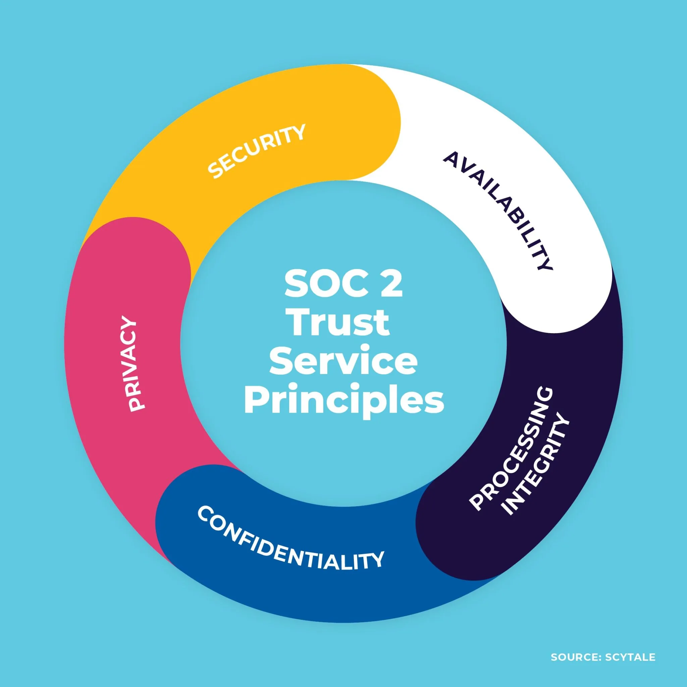

# SOC 2 Framework Explained: Trust Services Criteria

## Overview

SOC 2 (System and Organization Controls 2) is a framework developed by the American Institute of Certified Public Accountants (AICPA) that defines criteria for managing customer data based on five Trust Services Criteria (TSCs). Unlike other compliance frameworks, SOC 2 is flexible and can be tailored to an organization's specific services and needs.

## The Five Trust Services Criteria

### 1. Security 🔒
**The Common Criteria - Mandatory for All SOC 2 Reports**

Security is the foundational criterion that applies to all SOC 2 examinations. It focuses on the protection of system resources against unauthorized access.

#### Key Objectives:
- **System Protection**: Information and systems are protected against unauthorized access, unauthorized disclosure of information, and damage to systems that could compromise availability, integrity, confidentiality, and privacy.
- **Access Controls**: Logical and physical access controls are implemented to prevent unauthorized access.
- **Monitoring**: System activities are monitored to detect and respond to security events.

#### Common Controls:
- Multi-factor authentication (MFA)
- Firewalls and intrusion detection systems
- Encryption of data at rest and in transit
- Regular security awareness training
- Vulnerability management programs
- Incident response plans

### 2. Availability 🌐
**Optional Criterion**

Availability addresses whether systems, products, or services are available for operation and use as committed or agreed.

#### Key Objectives:
- **System Availability**: Systems are available for operation and use as committed or agreed.
- **Monitoring**: System processing capacity, usage, and performance are monitored to help meet availability objectives.
- **Recovery**: Procedures exist to recover systems in the event of failure or disruption.

#### Common Controls:
- Business continuity and disaster recovery plans
- System performance monitoring
- Backup and restoration procedures
- Redundant infrastructure
- Capacity planning processes
- Incident response procedures for availability events

### 3. Processing Integrity ⚙️
**Optional Criterion**

Processing Integrity addresses whether system processing is complete, valid, accurate, timely, and authorized.

#### Key Objectives:
- **Complete Processing**: System processing is complete.
- **Valid Processing**: System processing is valid, accurate, and timely.
- **Authorized Processing**: Processing is authorized.
- **Storage Maintenance**: Data is stored such that it remains complete, accurate, and valid.

#### Common Controls:
- Data validation and verification procedures
- Quality assurance processes
- Error detection and correction procedures
- Processing monitoring and logging
- Change management processes
- System testing procedures

### 4. Confidentiality 🤫
**Optional Criterion**

Confidentiality addresses whether information designated as confidential is protected as committed or agreed.

#### Key Objectives:
- **Confidential Information Protection**: Information designated as confidential is protected against unauthorized access and disclosure.
- **Data Classification**: Confidential information is identified and classified.
- **Secure Disposal**: Confidential information is disposed of securely.

#### Common Controls:
- Data classification policies
- Encryption of confidential data
- Access controls based on need-to-know
- Non-disclosure agreements (NDAs)
- Secure data transmission protocols
- Secure data destruction procedures

### 5. Privacy 🛡️
**Optional Criterion**

Privacy addresses the system's collection, use, retention, disclosure, and disposal of personal information in conformity with an organization's privacy notice and with criteria set forth in generally accepted privacy principles.

#### Key Objectives:
- **Notice and Communication**: Notice is provided about the entity's privacy policies and procedures.
- **Choice and Consent**: Individuals are given choice and consent regarding the collection, use, and disclosure of their personal information.
- **Collection Limitation**: Collection of personal information is limited to what is needed.
- **Data Quality**: Personal information is accurate, complete, and relevant.
- **Access**: Individuals can access their personal information for review and correction.
- **Disclosure Limitation**: Disclosure of personal information is limited to authorized parties.

#### Common Controls:
- Privacy policies and notices
- Consent management systems
- Data subject request procedures
- Data retention and disposal policies
- Privacy impact assessments
- Employee privacy training

## SOC 2 Report Types

### Type I
- **Focus**: Suitability of design of controls at a specific point in time
- **Period**: Single date assessment
- **Best For**: Early-stage companies or those new to SOC 2

### Type II
- **Focus**: Operational effectiveness of controls over a period of time
- **Period**: Typically 6-12 months
- **Best For**: Mature organizations requiring comprehensive assurance

## Implementation Approach

### Phase 1: Scoping & Readiness Assessment
1. Determine which TSCs are relevant to your services
2. Perform gap analysis against selected criteria
3. Define system boundaries and in-scope systems

### Phase 2: Control Implementation
1. Develop and document policies and procedures
2. Implement technical and operational controls
3. Establish monitoring and evidence collection processes

### Phase 3: Evidence Collection & Testing
1. Gather documentation proving control operation
2. Perform internal testing of control effectiveness
3. Prepare for external audit

### Phase 4: Audit & Certification
1. Engage independent CPA firm
2. Support audit process with evidence and interviews
3. Address any findings or exceptions

### Phase 5: Maintenance & Continuous Compliance
1. Monitor control effectiveness continuously
2. Update controls as systems and risks evolve
3. Prepare for periodic re-certification

## Common Scope Combinations

| Organization Type | Typical TSC Scope | Rationale |
|-------------------|-------------------|-----------|
| **SaaS Companies** | Security + Availability | Core infrastructure reliability and data protection |
| **Data Processors** | Security + Confidentiality + Privacy | Handling sensitive or personal data |
| **Financial Services** | Security + Availability + Confidentiality | Regulatory requirements and client data protection |
| **Healthcare** | Security + Availability + Privacy | PHI protection and service reliability |
| **Enterprise Platforms** | All Five TSCs | Comprehensive trust assurance for large clients |

## Key Considerations

### Security is Mandatory
- All SOC 2 reports must include the Security criterion
- Other criteria are selected based on business relevance

### Scalability
- Start with Security only for initial certification
- Add other criteria as business needs evolve
- Consider client requirements and industry standards

### Evidence Requirements
- Documentation must demonstrate consistent operation
- Automated evidence collection is recommended
- Regular testing and monitoring are essential

## Related Resources

- [AICPA Trust Services Criteria](https://www.aicpa.org/interestareas/frc/assuranceadvisoryservices/trust-services-criteria.html)
- [SOC 2 Guide for Startups](./soc2-startup-guide.md)
- [Control Implementation Templates](./templates/)
- [Compliance Automation Tools](./tools-and-resources.md)

---

*This document is part of the [Scalable SOC 2 Framework](https://github.com/ThiagoMaria-SecurityIT/A-Scalable-Framework-for-SOC-2-Compliance-From-Startup-to-Enterprise) project.*
